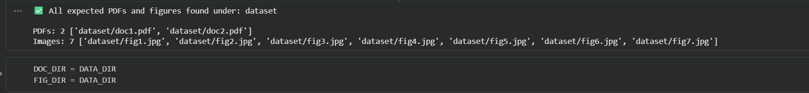
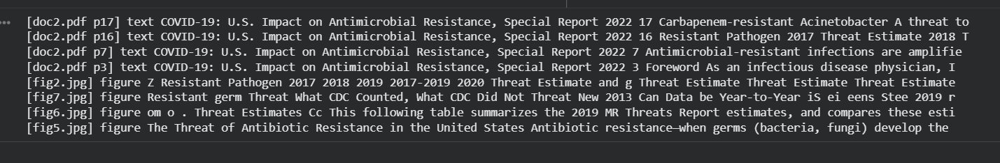
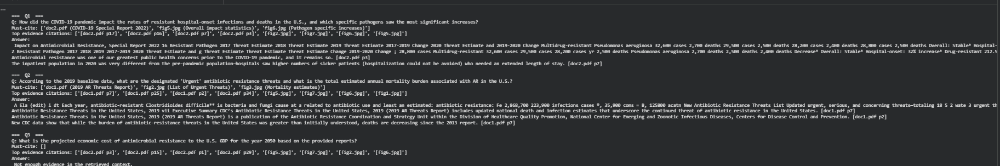
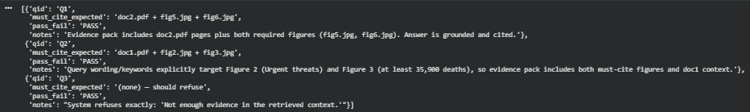

# CS 5588 — Week 3 Hands-On  
## Building a Multimodal RAG Product Prototype (PDF + Images)

**Due:** Feb. 5, 2026
**Submission:** Survey (repo link + individual contribution)

This repo contains a **stakeholder-ready multimodal RAG prototype** that answers questions using **PDF pages + figure/table OCR**, returns an **evidence pack**, and generates a **grounded response with enforced citations**. If evidence is missing, it refuses with:

> **Not enough evidence in the retrieved context.**

---

## 1) Product Brief (Required)

- **Team / Name:** Salman Mirza, Amy Ngo, and Nithin Songala
- **Project name (working title):** *Antibiotic Resistance Evidence Assistant*

### 1.1 Target user persona
**Public health analyst / hospital infection prevention lead** who needs fast, trustworthy answers from CDC antimicrobial resistance reports.  
**Pain point:** Important evidence is buried across long PDFs + charts/tables, and manual searching is slow and error-prone.

### 1.2 Problem statement (1–2 sentences)
Stakeholders need quick, accurate answers about antimicrobial resistance trends, threats, and COVID-era impacts, but relevant information is distributed across report text and figures/tables. This system supports evidence-backed decision-making by retrieving the right **pages + figures** and producing **grounded, cited answers**.

### 1.3 Value proposition (1 sentence)
Cuts **time-to-answer** while improving **trust and auditability** through an evidence pack + citation-enforced answers, with explicit refusal when evidence is incomplete.

### 1.4 Success metrics (2–3)
- **Time-to-answer:** < 30 seconds per stakeholder question (demo-scale).  
- **Citation coverage:** ≥ 2 citations per answer and includes must-cite items for Tasks 1–2.  
- **Refusal accuracy:** Task 3 returns **exact refusal** when reports do not contain the requested info.

---

## 2) Data (2 PDFs + 7 Figures)

All inputs are stored under `dataset/`.

### Data inventory table

| Source | Modality | File(s) | Role in product |
|---|---|---|---|
| CDC AR Threats Report (2019) | PDF | `dataset/doc1.pdf` | Baseline AR threats, national estimates |
| CDC COVID-19 Impact on AR (2022 Special Report) | PDF | `dataset/doc2.pdf` | COVID-era impact on resistant infections |
| CDC figures/tables | Image (JPG) | `dataset/fig1.jpg` … `dataset/fig7.jpg` | Tables/figures used as OCR evidence (must-cite support) |

✅ Dataset validation screenshot:  


---

## 3) System Architecture (Notebook Pipeline)

**Goal:** Stakeholder demo flow: **Question → Evidence Pack → Grounded Answer → Product Outcome**

### Pipeline stages
1. **PDF ingestion (per-page)**  
   - Extract text per page using PyMuPDF → `TextChunk(doc_id, page_num, text)`
2. **Image ingestion (OCR)**  
   - Run Tesseract OCR on figures/tables → `EvidenceItem(evidence_text)`
   - (Captioning is optional; skipped in this run)
3. **Chunking strategy**
   - Page-based indexing (baseline)
   - Fixed-size sub-chunks (250 words, overlap 40) for ablation readiness
4. **Indexing & retrieval**
   - Dense retrieval with SentenceTransformers → FAISS (inner product)
   - Sparse retrieval with BM25
   - Hybrid fusion (rank-based) + optional CrossEncoder reranking
5. **Grounded response**
   - Evidence-only answer generator with **citation enforcement**
   - Refuses when missing required evidence signals

---

## 4) Chunking & Ingestion Evidence

### PDF ingestion (per-page)


### Image OCR evidence items


### Chunking comparison


---

## 5) Stakeholder Tasks (Q1–Q3)

We defined 3 application-oriented stakeholder tasks:

- **Q1 / Q2:** require both **text + figure evidence**
- **Q3:** missing/ambiguous evidence → system must refuse

Demo output screenshots are included below.

---

## 6) Demo Run (Q1–Q3) with Citations

### Evidence pack preview (sample)


### Full demo run output


✅ Behavior requirements met:
- Evidence pack includes required must-cite evidence for Q1/Q2  
- Q3 refuses with **exact** phrase: `Not enough evidence in the retrieved context.`  
- Output is readable and citation-grounded

---

## 7) Week 3 Acceptance Tests (Required)

Acceptance checklist after running the demo:

- **Q1:** must-cite evidence included? ✅ PASS  
- **Q2:** must-cite evidence included? ✅ PASS  
- **Q3:** refuses with exact message? ✅ PASS  

Screenshot:


---

## 8) Failure Case + Mitigation (Required)

### Failure scenario (realistic)
**OCR noise / table misread** causes the system to retrieve the correct figure but extract incorrect numeric values (e.g., “35,900 deaths” becomes garbled). This can lead to **incorrect stakeholder decisions** (bad reporting, wrong policy conclusion, or misinformation shared internally).

### Organizational risk
- Incorrect numeric claims can damage trust in the product and cause poor decision-making.
- In a healthcare/public health context, errors can lead to flawed recommendations or reporting.

### Mitigation plan (system + UX)
- **System-side checks**
  - Require numeric claims to be supported by **multiple evidence sources** (e.g., figure OCR + PDF page text).
  - Add “numeric sanity checks” (detect impossible tokens, extreme OCR corruption, missing units).
  - If numeric extraction confidence is low, force refusal or request confirmation (“Evidence unclear, please verify figure”).
- **UX / governance**
  - Default to **“show evidence pack first”** and highlight must-cite evidence.
  - Add a **human-in-the-loop flag** for low-confidence OCR results.
  - Log and monitor failure patterns (which figures/pages fail most often).

---

## 9) What we would ship (tradeoff decision)

For a first production version, we would ship:
- **Hybrid retrieval + reranking** (best balance of recall and relevance)
- **Page-based indexing** for clean citations + stakeholder auditability  
- Fixed-size chunks remain available as an ablation option if recall issues appear

Reason:
- Page citations are easier to verify for stakeholders and reduce “citation mismatch” risk.
- Hybrid retrieval improves coverage across both narrative text and keywords in tables.

---

## 10) How to Run

### Option A (Recommended): Google Colab
1. Open the notebook in Colab
2. Run cells in order (Setup → Load data → Ingest → Index → Demo loop)
3. Confirm Q1–Q3 outputs match required behavior

### Option B: Local (Python)
Install deps:
```bash
pip install pymupdf pillow pandas numpy scikit-learn pytesseract faiss-cpu rank-bm25 sentence-transformers transformers